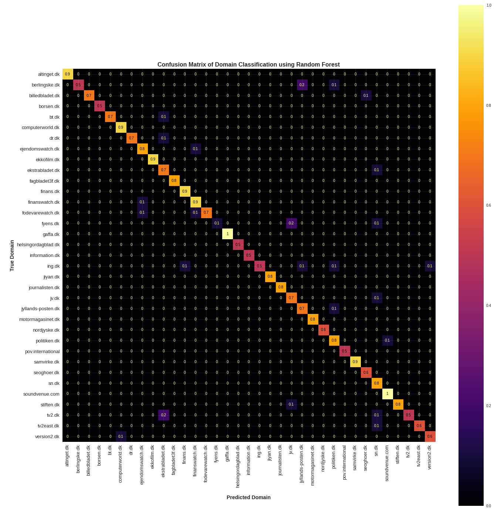
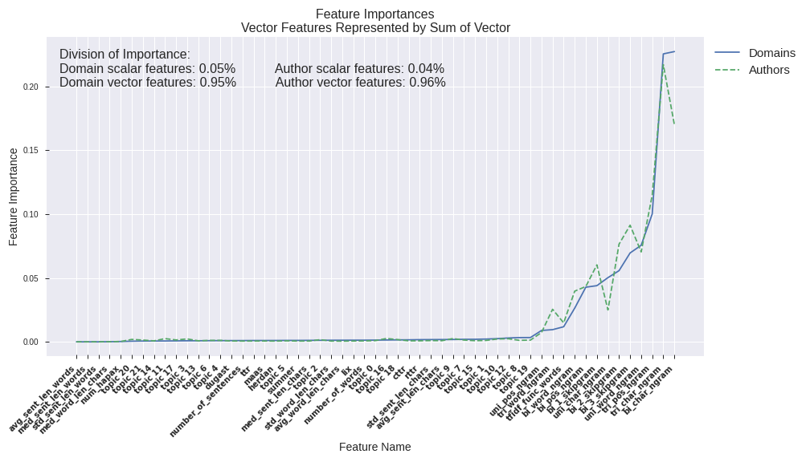

## articlencoding
The aim of this thesis is to apply a general-purpose encoding of Danish newspaper articles to authorship attribution, newspaper attribution, and headline generation with the aim of assessing the scalability of the encoding across tasks. From a novel dataset of 800k Danish online news articles, we test manually and automatically extracted features separately, as well as a combination of the two. Literature on attributing newspapers and using a handcrafted feature encoding for headline generation is scarce, creating incentive for an investigation of these fields. We found that manual features and a combination of manual and automatic features scale well across classification tasks, with performances consistently above baseline. The results obtained from headline generation were inconclusive as the training time for the model exceeded the thesis deadline. 

## Authorship Attribution
Below is the full-size authorship attribtution confusion matrix (100 classes). Enlarge for easier reading.

## Newspaper Attribution
And here is the full-size confusion matrix for the domain classification (35 classes).

## Feature Importances
Here is a large plot of feature importances for newspaper and authorship attribution gathered from a random forest.

